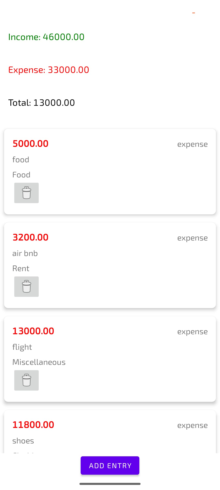

# 📱 Personal Finance Manager

**Personal Finance Manager** is a fully offline Android application developed using **Kotlin**, **XML**, and **Room Database (SQLite)**. It is designed to help users track their day-to-day financial activities including income and expenses, without requiring internet access.

This app was completely developed by me as part of my academic in-house project at Teerthanker Mahaveer University, Moradabad.

---

## 🚀 Features

- Add new **Income** and **Expense** entries
- Select predefined categories (Salary, Food, Rent, etc.)
- Attach short notes to describe each transaction
- View total **Income**, **Expenses**, and current **Balance** on the dashboard
- Data stored locally using **Room (SQLite)** – no internet required
- Lightweight, fast, and simple interface

---

## 📸 Screenshots

### ➕ Add Income Screen

### ➖ Add Expense Screen

### 🏠 Dashboard with Transaction List

> 📌 *To use these images, upload `income.jpg`, `expense.jpg`, and `dashboard.jpg` inside a `screenshots/` folder in your repo.*

---

## 📦 APK Download

➡️ [Click here to download the latest APK](https://github.com/yourusername/yourrepo/releases/latest)

> The app runs on Android 7.0 (Nougat) and above.

---

## 🛠️ Built With

- **Language**: Kotlin  
- **UI**: XML  
- **Database**: Room (SQLite)  
- **IDE**: Android Studio  
- **Architecture**: MVVM (Model-View-ViewModel)

---

## 📁 Project Structure

